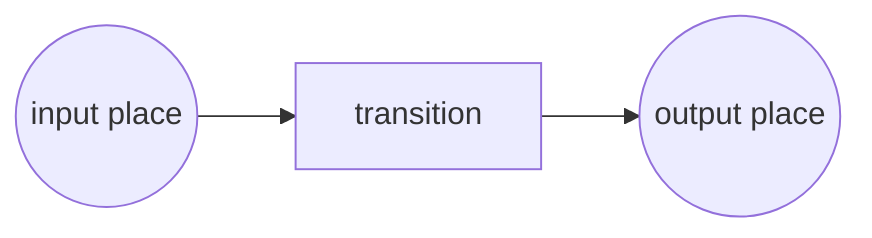

- Technique for the description and analysis of concurrent behaviour in distributed systems
- Simple graphical format and a precise operational semantics that makes them an attractive option for modeling the static and dynamic aspects of processes
- A Petri Net takes the form of a directed bipartite graph where the nodes are either `places` or `transitions`
- **Places** represent `intermediate states` that may exist during the operation of a process. Places are represented by `circles`
- Places can be input/output of transitions. **Transitions** correspond
  to the `activities or events` of which the process is made up.
  Transitions are represented by `rectangles` or thick bars
- **Arcs** connect places and transitions in a way that `places can only
  be connected to transitions and vice-versa`

`Places` can contain any number of `tokens` (represented by dots) that can be fired from input places to output places via `transitions`, if and only if the transition is `enabled` – this happens when there are `enough tokens` in the input places. When the transition fires, it expends the required tokens from the input places and generates them at the output places. This process changes the state of the Petri net. [see](https://www.jointjs.com/demos/petri-nets)

- A transition t is said to be enabled if each input place p of t contains at `least one token`.
- An enabled transition may fire. If transition t fires, then t `consumes one to-
  ken from each input place` p of t and produces one token in each output place
  p of t
- tasks are modeled by transitions, conditions are modeled by pla-
  ces, and cases are modeled by tokens page 15
- [see](file:///Users/simone.sacchi/Downloads/1998-the-application-of-petri-nets-to-workflow-management.pdf)

https://www.jointjs.com/demos/petri-nets

https://www.google.com/search?client=firefox-b-d&q=petri+net
here http://www.diag.uniroma1.it/~marrella/slides/Sem_PM_13-14_BPs_Fundamentals.pdf

