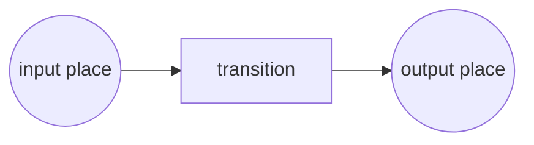

- Technique for the description and analysis of concurrent behaviour in distributed systems
- Simple graphical format and a precise operational semantics that makes them an attractive option for modeling the static and dynamic aspects of processes
- A Petri Net takes the form of a directed bipartite graph where the nodes are either `places` or `transitions`
- **Places** represent `intermediate states` that may exist during the operation of a process. Places are represented by `circles`
- Places can be input/output of transitions. **Transitions** correspond
  to the `activities or events` of which the process is made up.
  Transitions are represented by `rectangles` or thick bars
- **Arcs** connect places and transitions in a way that `places can only
  be connected to transitions and vice-versa`

https://www.google.com/search?client=firefox-b-d&q=petri+net
here http://www.diag.uniroma1.it/~marrella/slides/Sem_PM_13-14_BPs_Fundamentals.pdf
